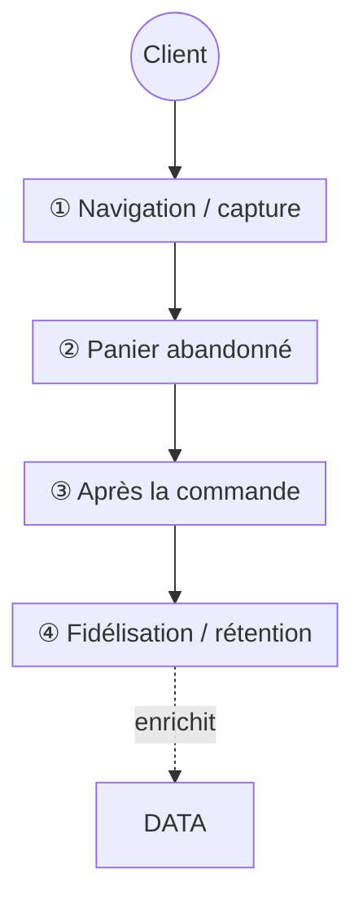
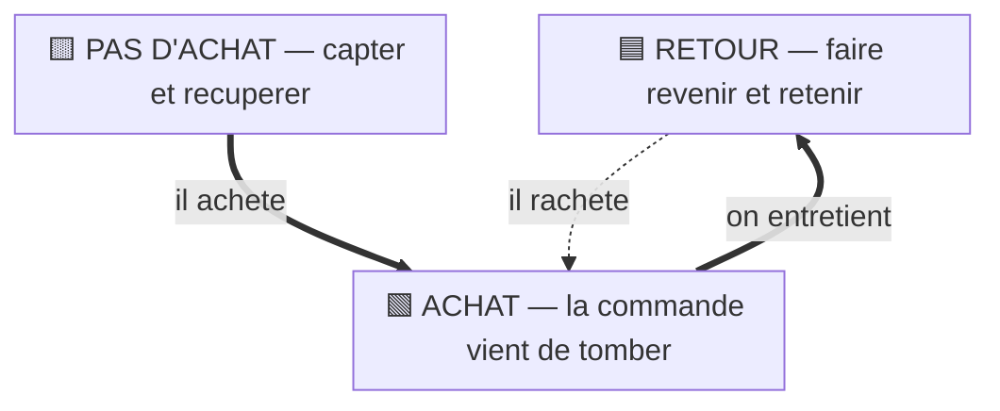
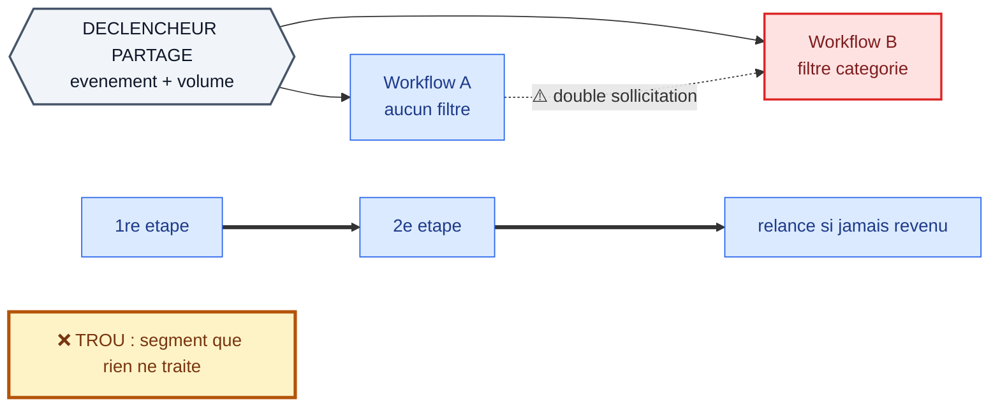

## ⛔ GATE CONSENTEMENT — avant toute action qui MODIFIE le portail

**Lire, chercher, analyser : libre.** **Créer, modifier ou supprimer** quoi que ce soit dans le
système d'un client : **jamais sans un « oui » explicite, donné dans le fil, avant d'agir.**

**Périmètre** — contacts, transactions, sociétés, propriétés, listes, workflows, automatisations,
séquences, templates, emails, et l'équivalent dans tout outil connecté (Notion, Make, Drive…).

**Le geste, avant un LOT d'écritures :**

```
Action prévue : [quoi]
Cible        : [portail / objet]
Impact       : [créer / modifier / supprimer N éléments]
Confirme ? (oui / non)
```

Attendre le « oui ». **Il couvre ensuite tout le lot annoncé** — on n'interrompt pas objet par objet.
On redemande uniquement si on **sort du périmètre annoncé**, ou si on découvre un **irréversible non
prévu**.

**Pas d'exception « petit changement » ou « facile à annuler ».** Et quand on te demande de modifier
X, tu modifies X — pas une refonte à ta façon. Désaccord sur l'approche → une question courte, jamais
un pivot décidé seul.

**Pourquoi c'est écrit ici en toutes lettres, et pas en renvoi** : un CRM client, ce sont des données
de production, souvent irréversibles, et la responsabilité est vis-à-vis du **client final**. Un
garde-fou qui pointe vers un fichier que tu n'as pas installé n'est plus qu'une intention.

# Skill — HubSpot Workflows Audit & Cartographie

## §0 But — comprendre l'automatisation d'un compte, d'un coup

Quand on arrive sur un compte CRM (ou qu'on veut « voir clair » sur ce qui tourne tout seul), on **cartographie TOUS ses workflows** : c'est la base pour comprendre comment le compte est automatisé, **qui** a construit quoi, et pour piloter ensuite (refonte, ménage, devis). Ce skill **aspire l'inventaire complet des définitions via API**, **complète par l'UI** ce que l'API ne sait pas (créateur, volumes d'enrôlés), classe les flows en familles, flag les problèmes de santé, et produit un **doc d'audit** + une **carte visuelle Mermaid**.

> C'est le **jumeau** de `hubspot-segments-audit`. Même philosophie (pull API → résumé lisible → flags santé → doc familles + cartographie + reco), autre objet : les **workflows** au lieu des **segments**.

## §1 Méthode = API d'abord, MAIS elle a 2 angles morts

L'**API est LA base** pour la structure : rapide, complète, déterministe (ex. 43 flows + leurs actions + déclencheurs en une passe). Mais elle **ne rend que la DÉFINITION** d'un flow. Deux choses qu'elle **ne donne JAMAIS** et qu'on va chercher dans l'UI (§3) :

- **le CRÉATEUR** du workflow (colonne « Créé par » — capital pour dire « mi4 a fait le cœur métier, l'agence la plomberie »),
- **les VOLUMES d'enrôlés** (total + récent — capital pour dire ce qui tourne vraiment vs ce qui dort).

**Endpoints** (Private App token, scope `automation` — cf `hubspot-crm` / `secrets.local`) :
- `GET /automation/v4/flows?limit=100&after=…` → **liste** tous les flows (résumé : `id`, `name`, `isEnabled`, `objectTypeId`). Paginer via `paging.next.after`.
- `GET /automation/v4/flows/{flowId}` → **définition complète** : `actions[]` (avec leur `type`) + `enrollmentCriteria` (le déclencheur).

> 🔴 **Un `GET` liste ne suffit PAS — il faut le `GET /{id}` par flow** pour avoir actions + déclencheur. Et **un 200 ne prouve rien** : après tout appel, on **re-GET et on compare** le champ réel à ce qu'on croit avoir — l'API HubSpot avale des champs en silence (elle stocke `BATCH_EMAIL` quand on demande `AUTOMATED_EMAIL`, etc.).

## §2 Script réutilisable (pull définitions + profil d'actions + flags → dump UTF-8)

> ⚠️ Windows : écrire la sortie dans un **fichier UTF-8** (pas `print` → crash cp1252 sur accents/emoji). Token depuis un fichier gitignored (`secrets.local`, cf `hubspot-marketing-segments` §2). Laisse **volontairement vides** les colonnes `Créateur` et `Enrôlés` : elles se remplissent depuis l'UI (§3) — l'API ne les a pas.

```python
import json,urllib.request,urllib.error
from collections import Counter
# Renseigne le chemin de TON fichier de secrets (ignore par git) — aucun emplacement n'est presume.
TOKEN=open("<chemin-vers-ton-fichier-de-secrets>").read().split("HUBSPOT_PRIVATE_APP_TOKEN=",1)[1].split("\n")[0].strip()
H={"Authorization":"Bearer "+TOKEN,"Content-Type":"application/json"}
def call(m,u,b=None):
    d=json.dumps(b).encode() if b is not None else None
    r=urllib.request.Request(u,data=d,method=m,headers=H)
    try:
        x=urllib.request.urlopen(r);bd=x.read().decode();return x.status,(json.loads(bd) if bd.strip() else {})
    except urllib.error.HTTPError as e: return e.code,{}
OBJ={"0-1":"Contact","0-2":"Company","0-3":"Deal","0-5":"Ticket"}
ACT={"DELAY":"Délai","DELAY_UNTIL_DATE":"Délai","EMAIL":"Envoi email","SINGLE_CONNECTION":"Envoi email",
     "SET_PROPERTY":"Set propriété","EDIT_RECORD":"Set propriété","ASSOCIATE_OBJECTS":"Assoc.",
     "LIST_BRANCH":"Branche","BRANCH":"Branche","WEBHOOK":"Webhook 🔗","CREATE_TASK":"Tâche"}
def first_prop(o):                       # 1re propriété citée n'importe où dans le déclencheur
    if isinstance(o,dict):
        v=o.get("property")
        if isinstance(v,str): return v
        for x in o.values():
            p=first_prop(x)
            if p: return p
    elif isinstance(o,list):
        for x in o:
            p=first_prop(x)
            if p: return p
    return None
# 1) LISTER tous les flows (résumé)
flows=[];after=None
while True:
    u="https://api.hubapi.com/automation/v4/flows?limit=100"+("&after=%s"%after if after else "")
    c,r=call("GET",u); flows+=r.get("results",[])
    after=(r.get("paging") or {}).get("next",{}).get("after")
    if not after: break
# 2) GET la DÉFINITION de chaque flow → profil d'actions + déclencheur + flags santé
rows=[]
for f in flows:
    fid=f.get("id"); c,d=call("GET","https://api.hubapi.com/automation/v4/flows/%s"%fid)
    acts=Counter(a.get("type") for a in d.get("actions",[]))
    prof=" · ".join("%s×%d"%(ACT.get(t,t),n) for t,n in acts.items()) or "(aucune)"
    ec=d.get("enrollmentCriteria") or {}; trg=ec.get("type","?"); prop=first_prop(ec)
    name=f.get("name","") or ""; on=bool(f.get("isEnabled")); nact=sum(acts.values())
    flags=[fl for fl,cond in [
        ("OFF",not on),
        ("BROUILLON-ABANDONNÉ",(not on) and name.lower().startswith("unnamed workflow")),
        ("VIDE-0-action",nact==0),
        ("DÉJÀ-ARCHIVÉ","archive" in name.lower()),
    ] if cond]
    rows.append((fid,OBJ.get(f.get("objectTypeId"),f.get("objectTypeId")),name[:52],
                 "ON" if on else "off","%s%s"%(trg,"(%s)"%prop if prop else ""),prof,flags))
# 3) DUMP lisible (ON d'abord, puis alpha) — colonnes UI laissées vides (§3)
rows.sort(key=lambda x:(x[3]!="ON",x[2].lower()))
with open("<path>/_workflows-dump.local","w",encoding="utf-8") as fo:
    fo.write("# %d flows (%d ON / %d off)\n\n"%(len(rows),sum(r[3]=="ON" for r in rows),sum(r[3]!="ON" for r in rows)))
    fo.write("| ID | Objet | Nom | Etat | Déclencheur | Actions | ⚠️ | Créateur (UI) | Enrôlés total/7j (UI) |\n")
    fo.write("|--|--|--|--|--|--|--|--|--|\n")
    for x in rows:
        fo.write("| `%s` | %s | %s | %s | %s | %s | %s |  |  |\n"%(x[0],x[1],x[2],x[3],x[4],x[5]," ".join(x[6])))
```

## §3 Les 2 angles morts → lecture UI (créateur, enrôlés) + Make = boîte noire

L'API n'a **ni** le créateur **ni** les enrôlés. On les lit dans l'UI, une fois, pour compléter les 2 colonnes vides du dump :

- **Ouvrir la liste des workflows** : `https://app.hubspot.com/workflows/{portail}/view/all` → **`get_page_text`** (Chrome MCP). La table liste **« Créé par »** + **volumes d'enrôlés** (total, et souvent « X sur 7 jours »). Recouper par nom/ID avec le dump API.
- **Créateur = clé de lecture** : c'est ce qui permet de dire « **mi4** (l'ancienne agence) a bâti le cœur métier lifecycle · **l'agence (l'utilisateur)** a bâti la plomberie data ». La **couleur de la carte Mermaid = le créateur** (§5).
- **🔗 Make / n8n / Zapier = BOÎTE NOIRE.** Un flow qui envoie de la donnée à Make (action `WEBHOOK`, ou une propriété « … envoyée à Make ») ne montre côté HubSpot **que sa moitié** : le vrai scénario vit **sur le compte Make du client**. → on le **note** (« 🔗Make »), on **demande l'accès au client** pour vérifier, et on **ne touche à rien** sans go explicite. On documente uniquement ce que le workflow HubSpot fait (« tague X et l'envoie à Make pour Y »), pas ce qu'on ne voit pas.

## §4 Flags santé (le « bilan »)

- **OFF** (désactivé) — normal (saisonnier, en pause) **ou** oublié ? Le créateur + la date aident à trancher.
- **BROUILLON-ABANDONNÉ** — nom `Unnamed workflow - <date>` **et** off = essai jamais fini (il y en a souvent une pile — cf <Client> : ~10 des 20 éteints).
- **VIDE-0-action** — coquille sans aucune action.
- **DÉJÀ-ARCHIVÉ** — nom qui porte déjà la balise `🗄️ ARCHIVE …` (convention client, cf ci-dessous).

> ⚖️ **On ARCHIVE, jamais on ne supprime.** Un workflow mort/raté se **renomme** avec une balise en tête `🗄️ ARCHIVE <YYYY-MM-DD> — <pourquoi>` (convention d'archivage de ce pack), on n'y touche plus, purge éventuelle après ~6 mois. **Rigueur** : ne jamais conclure « inutile » sur un simple indice (OFF, faible volume) → **inspecter `actions` + `enrollmentCriteria` réels** avant d'affirmer, et croiser avec le créateur/les enrôlés UI (un faible volume peut être une niche voulue).

## §5 Le doc d'audit (livrable type) + carte Mermaid

Structure (cf `memory/clients/<client-slug>/audit-workflows.md`, le livrable **prouvé** : 43 flows, 23 actifs) :

1. **🧭 Ce qui ressort** — qui fait quoi (par créateur), les volumes, les points Make. 3-5 lignes en tête.
2. **🟢 MÉTIER / lifecycle marketing** (table triée par volume) — `ID · Nom · Déclencheur · Actions · Enrôlés total · 7j · Créé par`. C'est le parcours d'achat (anniversaire, panier abandonné, cross-selling, fidélisation, inactivité…).
3. **🔧 DATA OPS / plomberie** (même table) — owners, copies d'ID, associations entreprise↔transaction, set marketing. Ça tourne **sous** le parcours.
4. **⏻ Les éteints** (contexte, table légère `ID · Objet · Nom`).
5. **🗺️ Carte visuelle Mermaid** (ci-dessous).
6. **▶️ Reste à cadrer / devis** (créateurs manquants, alertes portail, revenu par workflow = souvent hors V1).

**Les 2 familles = la grille de lecture centrale** :
- **MÉTIER / lifecycle** = ce que le client *veut* (marketing sur le parcours d'achat).
- **PLOMBERIE data** = ce qui *fait tenir* la data (owners, IDs, associations) — invisible mais vital.

**Carte visuelle = Mermaid, PAS Whimsical.** Le source Mermaid est du **texte** → il vit à côté de l'audit, se **régénère avec lui** (jamais de dérive), et **se rend nativement dans Notion** (bloc `mermaid`), en HTML ou sur GitHub. Whimsical = outil externe à piloter à la main = **2ᵉ source à maintenir** = dérive garantie. **Organiser le flowchart sur le parcours d'achat** (Navigation → Panier → Après commande → Fidélisation), **couleur = créateur**, **plomberie data en sous-graphe** dessous, chiffres = enrôlés. Squelette :



### §5bis Le 2ᵉ axe de lecture — par SCÉNARIO client (Achat · Pas d'achat · Retour)

Le squelette ci-dessus range les workflows par **étape du parcours**. C'est un tunnel : utile pour raconter le chemin, mais il fait croire que chaque workflow est une case indépendante, et il noie la question que le client se pose vraiment — *« qu'est-ce que je fais de ceux qui achètent, de ceux qui n'achètent pas, et de ceux que je veux faire revenir ? »*

D'où un **2ᵉ axe** : 3 couloirs qui se lisent comme 3 leviers business.

| Couloir | Ce qu'il regroupe |
|---|---|
| 🟩 **ACHAT** | la commande vient de tomber — cross-sell, feedback, accueil du nouveau client |
| 🟨 **PAS D'ACHAT** | navigation sans achat, panier abandonné, capture de lead |
| 🟦 **RETOUR** | réactivation des dormants, fidélisation, anniversaire, annulation |

Les 2 axes coexistent : le parcours pour expliquer le flux, le scénario pour décider où investir. Produire l'axe scénario dès que l'audit sert à **prioriser** (proposition commerciale, plan d'optimisation) plutôt qu'à décrire.

**⚖️ Le point de décision — DÉCLENCHEUR ou OBJECTIF ?** Un workflow s'enrôle sur un événement, mais vise souvent autre chose. Cas typique : les workflows de fidélisation se déclenchent sur *un achat complété* (→ couloir ACHAT si on suit le déclencheur) alors que leur job est de faire **racheter** (→ couloir RETOUR si on suit l'objectif). Ranger par l'un ou par l'autre change la carte, et donc la conclusion.

La règle : **si la divergence touche 3 workflows ou plus, produire les DEUX variantes** et laisser le lecteur trancher — la comparaison est elle-même une information. Recommander **par objectif** pour un usage business ou client (elle se lit comme des leviers), **par déclencheur** pour du debug d'enrôlement (elle dit littéralement qui entre où). Noter la répartition de chaque variante (ex `4/3/6` vs `7/3/3`) : l'écart montre d'un coup d'œil combien de workflows sont ambigus.



Un nœud en `alerte` (rouge) signale un workflow **en souffrance** — volume effondré, filtre devenu trop étroit, audience majoritairement inatteignable. Mettre la raison dans le nœud (`⚠️ 89% anonymes`) : c'est ce qui transforme une carte en diagnostic.

### §5ter Le 3ᵉ diagramme — RELATIONS & COUVERTURE

C'est le manque des deux premiers : ils montrent des workflows **côte à côte**, jamais **reliés**. Or ce qui se vend dans un audit, c'est rarement la liste — c'est ce que la liste cache. Trois choses à faire apparaître :

1. **Les clusters de même déclencheur.** Plusieurs workflows s'enrôlent souvent sur le *même* événement et ne diffèrent que par leur filtre. Conséquence directe et invisible dans un tableau : un contact peut entrer dans deux d'entre eux le même jour → **double sollicitation**. La signaler par une arête en pointillé entre les deux nœuds concernés.
2. **Les chaînes sur une même propriété**, qui traversent les couloirs. Exemple récurrent, le compteur de commandes : *accueil du 1ᵉʳ acheteur → pousser la 2ᵉ commande → relancer celui qui n'est jamais revenu*. Trois seuils, une seule propriété, une vraie histoire à raconter au client.
3. **Les trous de couverture** — ce qu'**aucun** workflow ne traite. À poser en nœuds distincts et voyants, pas en note de bas de page : c'est presque toujours l'information la plus vendeuse de l'audit (le segment ignoré, la mesure absente).



⚠️ **Éviter `stroke-dasharray` dans les `classDef`** — certains renderers le refusent et cassent tout le bloc en silence. Contraster par `fill` + `stroke-width`, c'est portable partout. Même prudence sur les accents : les garder hors des libellés de nœuds évite les surprises d'un renderer à l'autre.

**Où poser le livrable** : la carte se rend sur une **page Notion** dans le hub du client (bloc `mermaid`) ; le doc technique miroir reste dans `memory/clients/<slug>/audit-workflows.md` (§32 global : la connaissance = la source, versionnée). Produire les 3 diagrammes dans ce meme fichier, sous une section « Cartes par SCENARIO ».

## §6 Prérequis + garde-fou read-only

- **Token** Private App (scope `automation`), gitignored (`secrets.local`). Le bon token full-access sur <Client> = app `get-schemas` (celui que tu as créé avec les scopes listés dans le README), pas un token limité.
- **🔒 Read-only par défaut.** Cet audit **lit**, il ne modifie **aucun** workflow live. Toute modification d'un workflow existant (activer, éditer, archiver-renommer) = **objet live** → **validation l'utilisateur AVANT de toucher** (**gate consentement** en tête de ce fichier). Créer un doc/une carte à côté = autonome ; toucher un flow = on demande.
- **Si un jour on ÉDITE** (avec go) : `PUT /automation/v4/flows/{id}` exige le **body COMPLET** (`isEnabled`, `revisionId`, `type` — sinon 400) ; objet `0-1` → `type: CONTACT_FLOW` (`PLATFORM_FLOW` refusé).

## §7 Cas inaugural — <Client> (2026-07-21)

Portail `<portal-id>` : **43 flows cartographiés · 23 ACTIFS · 20 OFF** via ce flow (API `automation/v4/flows` + lecture UI pour créateur & enrôlés) → `memory/clients/<client-slug>/audit-workflows.md` (dump : `_workflows-dump.local`). Findings : **13 workflows métier lifecycle** (cœur bâti par **mi4** — un ancien collaborateur, un ancien collaborateur) · **10 data-ops plomberie** (bâtis par **l'agence**) · **1 point Make** (Browsing History → boîte noire, accès demandé au client) · une pile de « Unnamed workflow » abandonnés côté éteints · carte Mermaid rendue sur Notion (« Cartographie des automatisations HubSpot »).

**Suite 2026-07-28 — d'où viennent §5bis et §5ter.** Le même portail a servi de banc d'essai à l'axe scénario : les 13 workflows lifecycle rangés en **4/3/6** par objectif contre **7/3/3** par déclencheur (3 workflows de fidélisation ambigus, d'où la règle des 2 variantes). Le diagramme relations y a révélé ce que les tables cachaient : **6 workflows sur 13 partagent le même pool d'enrôlement** (risque de double sollicitation prouvé sur un cas réel), une chaîne à 3 seuils sur le compteur de commandes, et **2 trous de couverture** (le visiteur anonyme, très majoritaire dans le trafic panier, et l'absence totale de mesure du revenu par workflow).

## Skills liés
`hubspot-segments-audit` (le jumeau, pour les segments) · `revops-api-scripts` (scripter l'API HubSpot) · `crm-investigation-output` (format de rendu) · `hubspot-crm` (règles CRM + token) · `claude-breeze` (le jumeau UI-first — déléguer le diagnostic à Breeze en tokens gratuits, OU auditer écran par écran une fonctionnalité sans API de dump).
